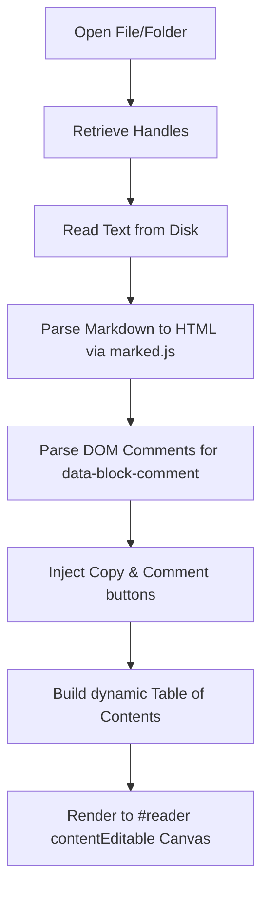
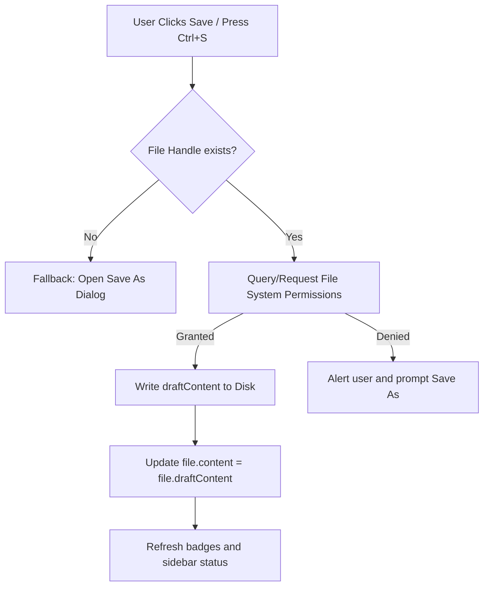

# MD Editor - Application Reference Guide

The **MD Editor** is a clean, modern, browser-based Markdown editor and reader that works directly with local files and directories on the user's system using the **Web File System Access API**. It features a rich, responsive reading layout combined with an in-place visual editing experience.

---

## 1. Overview & Key Capabilities

The MD Editor functions as a client-side Single Page Application (SPA). It is designed to act as a distraction-free environment for reading and composing Markdown files.

### Core Features

*   **Native File System Access**: Opens entire directories or individual files directly from the local file system. It retains read/write permissions via security-token restoration.
*   **In-Place Visual Editing**: Edits content directly inside the formatted preview canvas via `contentEditable="true"`. The app compiles Markdown to HTML on load, and translates HTML edits back to clean Markdown in real-time.
*   **Drafting & Autosave**: Automatically caches active drafts to `localStorage` (safeguarding up to ~4.5MB of files). If changes are made, it displays a *"Draft autosaved"* state, preventing data loss even if the tab is closed or refreshed.
*   **Persistent File Handles (IndexedDB)**: Uses IndexedDB to store serialization of file and directory handles. This enables the user to quickly restore file access across browser sessions without picking the folders again.
*   **Dynamic Table of Contents (TOC)**: Auto-generates a tree layout from heading tags (`#` through `####`). It tracks scrolling sections using an `IntersectionObserver` to highlight the current section and allows manual item expansion or collapse.
*   **Block-Level Copy**: Quick-copy icons appear next to paragraphs, headers, tables, code blocks, and list items. Clicking the icon translates that block's formatted content back into Markdown syntax and copies it to the clipboard.
*   **Block-Level Inline Commenting**: Floating comment boxes can be opened for any individual document section/block. Comments are stored as inline HTML-style comments (`<!-- Prefix: Comment -->`) directly inside the Markdown text, and are preserved on load and save.
*   **Highlight Toolbar**: Highlighting text in the reader triggers a custom floating toolbar containing:
    1.  **Copy Selection**: Copies the highlighted text to the clipboard.
    2.  **Google Search**: Performs a Google search for the highlighted text in a new browser tab.
*   **Theme & Zoom Controls**: Supports a dark/light mode toggle (saving preference to `localStorage`) and incremental zoom (80% to 200%) to adapt the font size to the user's preference.

---

## 2. User Interface Structure

The application's layout is split into three main areas governed by responsive CSS container queries and adjustable resizing handles:

```
+-------------------------------------------------------------------------+
|                               DOC HEADER                                |
|  [Doc Name] [Save Status Badge]                  [Save] [Save As...]    |
+-----------------------------------+-------------------------------------+
|                                   |                                     |
|             SIDEBAR               |          PREVIEW CONTAINER          |
|                                   |                                     |
|   +---------------------------+   |   +-----------------------------+   |
|   | Brand Title & Theme Toggle|   |   |                             |   |
|   +---------------------------+   |   |   Formatted Reader Canvas   |   |
|   | Folder / File Open Btns   |   |   |   (contentEditable="true")  |   |
|   +---------------------------+   |   |                             |   |
|   | Search Input Filter       |   |   |   [Copy Btn]  [Comment Btn] |   |
|   +---------------------------+   |   |                             |   |
|   | File List                 |   |   +-----------------------------+   |
|   |                           |   |                                     |
|   | - File A (Dirty Dot)      |   |                                     |
|   | - File B                  |   |                                     |
|   | - File C                  |   |                                     |
|   +---------------------------+   |                                     |
|                                   |                                     |
+-----------------------------------+-------------------------------------+
```

1.  **Sidebar (Left Panel)**:
    *   Holds the app logo, zoom buttons (`A−`, `100%`, `A+`), and the light/dark theme toggle (`◐`).
    *   Provides file loading triggers: **Open folder** and **Open files...** as well as **Restore Folder Access** if permission needs re-granting.
    *   Search bar filters files by filename or content matching.
    *   File list items show dirty indicator dots (`.dirty-dot`) for files with unsaved draft changes.
    *   Resizable from `180px` to `450px`.
2.  **Main Document Viewer (Center Panel)**:
    *   **Doc Header**: Displays the current file name and a dynamic badge (`Draft autosaved`, `Saving draft...`, `Saved to disk`). Contains the main **Save** and **Save As...** buttons.
    *   **Reader Canvas (`#reader`)**: Rendered Markdown output. Becomes editable in-place on click.
    *   **Floating Comment Box**: Placed on the right margin of the active hover element. Allows editing and deleting of block-level comments.
3.  **Table of Contents (Right Panel)**:
    *   Collapsible tree showing document structure. Expand-all and collapse-all utility buttons are placed at the top.
    *   Highlights the active section in real-time as the user scrolls.

---

## 3. Data Lifecycle & State Management

### State Model
The frontend application maintains the following state object:
```javascript
const state = {
  files: [], // Array of: { name, path, content, draftContent, handle, isAutosaved }
  activeIndex: -1,
  query: '',
  directoryHandle: null,
};
```
*   `content` represents the actual data saved on disk.
*   `draftContent` holds the local user edits (unsaved changes). If `draftContent !== content`, the file is marked as dirty.

---

### The Loading & Rendering Pipeline



1.  **File Read**: Content is loaded via the `FileSystemFileHandle` or dragged file entry.
2.  **Marked Parsing**: `marked.parse(content)` translates Markdown elements into semantic HTML elements (`h1-h6`, `p`, `pre`, `table`, etc.).
3.  **Comment Extraction (`extractCommentsFromDOM`)**:
    *   Scans the HTML DOM for native Comment nodes (`Node.COMMENT_NODE`).
    *   Looks for comments matching the syntax: `<!-- PrefixText: CommentBody -->`.
    *   Extracts `CommentBody`, associates it as metadata on the previous element using `dataset.blockComment`, and strips the comment node from the active DOM.
4.  **UI Enhancements**: Appends copy and comment button DOM nodes inside each block element. Builds the Table of Contents, binds scroll listeners, and opens the editor.

---

### The Editing & Autosave Pipeline

```mermaid
graph TD
    A[User Edits text inside #reader] --> B[Input Event Fires]
    B --> C[Convert HTML back to Markdown via readerToMarkdown]
    C --> D[Save output to files[activeIndex].draftContent]
    D --> E[Update Save Status Badge]
    E --> F[Debounce: Build TOC & update localStorage cache]
```

1.  **Direct DOM Input**: The browser captures input events within the `contentEditable` reader.
2.  **HTML Serialization (`readerToMarkdown` / `elementToMarkdown`)**:
    *   Traverses the children of the `#reader` block-by-block.
    *   Translates headers, lists, tables, code blocks, blockquotes, and paragraphs back to Markdown.
    *   If an element has `dataset.blockComment`, it appends `<!-- Prefix: Comment -->` to the end of that block's markdown sequence.
3.  **Local Sync**: Updates `state.files[state.activeIndex].draftContent`.
4.  **Autosave Debounce**: Persists the complete `state.files` representation into `localStorage` under `md-editor-cache`.

---

### The Saving Pipeline



---

## 4. Key Implementation Details

### File Handle Persistence & Restoration
The File System Access API handles do not persist by default across page reloads due to security policies. The editor bypasses this constraint by serializing handles inside **IndexedDB**:
*   **DB Configuration**:
    *   Database: `md-editor-db`
    *   Object Store: `handles-store`
*   **Serialization Rules**:
    *   Stores `files-source-type` (`'directory'` or `'files'`).
    *   Stores the parent directory handle as `directory-handle`.
    *   To prevent cloning failures of complex structures, file handles are serialized individually key-by-key: `'file-handle:' + file.name`.
*   **Restoration Flow**:
    1.  On boot, `initHandlesRestore()` checks the source type.
    2.  If `directory`, it checks if permission is already granted. If not, it shows the **Restore Folder Access** button.
    3.  Once the user grants permission, it re-scans the directory structure (`walkDirForHandles`), matches handles with cached file paths, and re-reads file content from disk.
    4.  If a file is not dirty (i.e., local draft matches the old content), it updates the local draft content with the fresh disk content. This keeps the application synced with external edits.

### Block Comment Integration
Block comments allow users to leave comments inside Markdown files at a block/section level:
*   **Format**: `<!-- SectionPrefix...: Comment Content -->`
    *   The prefix is automatically generated from the first 12 characters of the element's text content followed by `...` (e.g., `<!-- Introduction...: This needs revision -->`).
*   **UI Hover Lock**:
    *   Hovering over a copyable block shows the comment button.
    *   If a block has a comment, the comment button stays visible and highlighted.
    *   To prevent premature closing when moving the cursor from the block to the floating comment card, the state tracks `activeBlockHovered`, `commentBoxHovered`, and `commentBoxFocused` lock states. The card hides only if all three states are inactive.
    *   Pressing **Save** or **`Ctrl/Cmd + Enter`** inside the comment textarea saves the comment, updates the file draft, and triggers an autosave.
    *   Clicking **Delete** removes the comment metadata and strips the comment string from the Markdown structure.

### Floating Selection Toolbar
*   Listens to the document `selectionchange` event.
*   If selected text is detected inside the `#reader` element, the app calculates the selection boundary coordinates using `range.getBoundingClientRect()`.
*   Positions the `#highlight-toolbar` above the highlighted text.
*   **Copy Selection** copies the plaintext selection.
*   **Search Selection** opens a new browser window/tab targeting `https://www.google.com/search?q={selection}`.

---

## 5. Keyboard Shortcut Directory

| Shortcut | Scope | Action |
| :--- | :--- | :--- |
| **`Ctrl/Cmd + S`** | Global | Saves the active draft directly to the disk file. |
| **`Ctrl/Cmd + Shift + S`** | Global | Opens the "Save As..." system dialog. |
| **`Ctrl/Cmd + +`** | Global | Zooms in the reader canvas font size. |
| **`Ctrl/Cmd + -`** | Global | Zooms out the reader canvas font size. |
| **`Ctrl/Cmd + 0`** | Global | Resets zoom level to 100%. |
| **`j`** | Viewer (unfocused) | Switches view to the next file in the list. |
| **`k`** | Viewer (unfocused) | Switches view to the previous file in the list. |
| **`/`** | Viewer (unfocused) | Focuses the sidebar search input. |
| **`Ctrl/Cmd + Enter`** | Comment Box | Saves the active comment and closes the comment card. |
